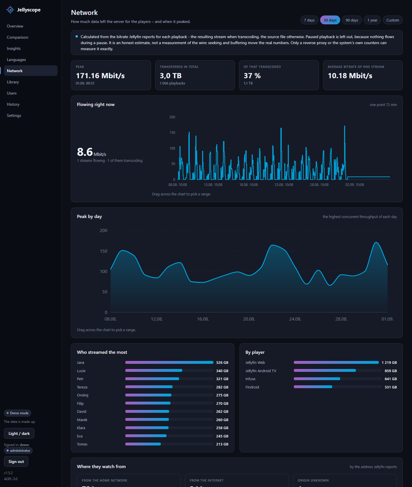
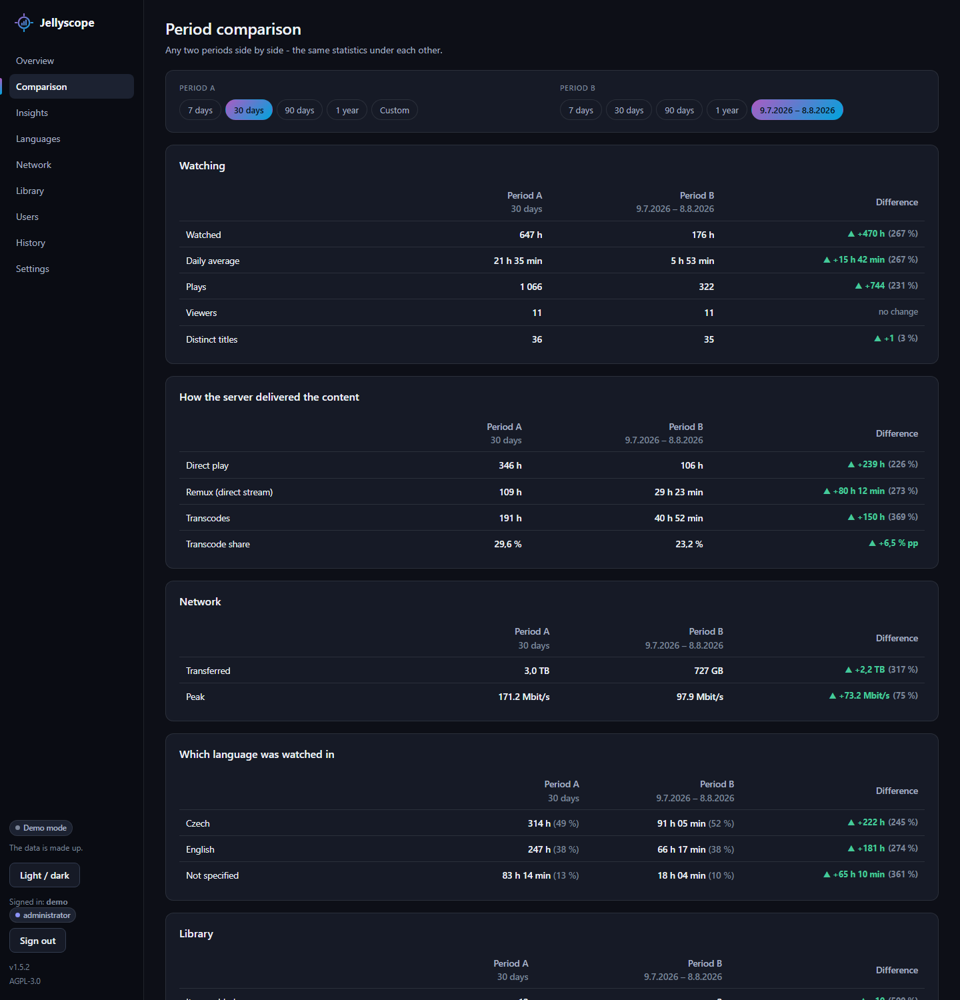

# Jellyscope

[](https://github.com/SpeeDFireCZE/jellyscope/actions/workflows/tests.yml)
[](LICENSE)
[](https://jellyscope.cz)
[](https://translate.jellyscope.cz/)
[](https://www.python.org/downloads/)

Jellyfin statistics that **connect what people watch with the technical
state of the library**.

Inspired by two existing projects:

- **[Jellystat](https://github.com/CyferShepard/Jellystat)** — knows *what is
  being watched*
- **[MediaLyze](https://github.com/frederikemmer/MediaLyze)** — knows *what
  those files are*

Jellyscope is not a copy of either. It is an independent implementation of
both ideas in one app, because only together can they answer questions
neither can answer alone:

> "How many terabytes are taken up by content nobody has watched in a year?"
> "Which file makes the server transcode most often?"
> "What do I watch the most — and do I even have it in decent quality?"
> "Which 60 GB 4K film did I watch once and never again?"

---

## What it looks like

**Insights** — the page the whole project exists for. Behaviour meets
technique: how much space is taken by things nobody watches, which files
make the server transcode, what you have in 4K and never finished.


**Overview** — what is playing right now, what was added, and the numbers
for the chosen period.


**Network** — how much data left the server, when it peaked, and where
people watch from. Addresses from outside the home network are placed on
a map you can zoom into.



**Comparison** — any two periods side by side, the same statistics under
each other: watching, how the server delivered it, network, languages and
what the library gained or lost.



| Library | Languages |
|---|---|
|  |  |
| Codecs, resolutions and sizes of what you really have. | What language people watch in — and what the library offers. |

<sub>Screenshots are from the demo mode, so the data is made up and the
posters are empty — a real installation loads them from Jellyfin.</sub>

The colours come from Jellyfin's own — blue `#00A4DC` and purple
`#AA5CC3`. If you preferred the earlier look, **Settings → Interface**
switches back to it; the classic appearance restores the old colours and
the old shapes, and you can switch again whenever you like.

---

## What it does

| Page | Contents |
|---|---|
| **Overview** | Live playbacks, watched time, most active users and titles, transcode share, a "when do people watch" heatmap |
| **Comparison** | Any two periods side by side — watching, delivery, network, languages, library growth |
| **Insights** | Dead storage, most transcoded files, upgrade candidates, oversized files, possible duplicates |
| **Languages** | Language split in percent, who watches dubbed and who in the original, subtitles, titles with no Czech track |
| **Network** | Throughput over time, volume transferred, home network vs internet, a map of where people watch from |
| **Library** | Tiles for each Jellyfin library → detail with Overview / Media / Activity tabs → file detail; day-by-day growth of the whole library |
| **Users** | Watch time per user, devices, individual detail |
| **History** | Every recorded playback, with language and links to the user and the title |
| **Your own dashboard** | An extra tab you compose yourself out of the cards the other pages are made of — off until you switch it on |
| **Settings** | Jellyfin connection, data collection, scheduled tasks and backups, notifications, history import, database, accounts, blocked logins, log, interface, general |

### Library and file detail

`/library` shows **a tile per Jellyfin library** with a poster, size and
title count. Opening one gives three tabs:

- **Overview** — codecs, resolutions, languages in this library
- **Media** — a poster grid with file size, sorting and search
- **Activity** — what was watched from this library, by whom and when

A tile opens the **file detail**: container, path, size, video track,
**every audio track with language and channel count**, **every subtitle**
(including *forced* / *external file* flags), the playback history of that
title, and for episodes a list of the other episodes.

There is a **Reload metadata** button on each title. It asks Jellyfin about
that one title — handy after you fix wrong metadata on the Jellyfin side
and do not want to wait for the nightly sync.

Images are downloaded from Jellyfin **through Jellyscope** and cached on
disk, so the Jellyfin address and API key never reach the browser.

### Two sources of technical data — you pick in Settings

The choice only affects **file details** (codec, resolution, bitrate, size):

- **Jellyfin API only** — we take what Jellyfin reports. Works immediately,
  needs nothing extra.
- **ffprobe + Jellyfin** — files are read directly from disk. More accurate,
  but needs ffmpeg installed and access to the files.

**Playback statistics always come from Jellyfin** — ffprobe can read a file,
not tell who watched what. The list of titles, users and libraries comes
from Jellyfin either way.

### Languages

Which language people actually pick, per user and per title — including
"they had a choice and picked Czech anyway" versus "there was nothing else".
Titles whose audio track has no language code at all get their own page, so
you can fix the files rather than guess.

### Network

How much data left the server for the players, and when it peaked. The
throughput curve is not sampled: every playback adds its bitrate at its
start and takes it away at its end, so the curve is exact. Alongside it:
the volume transferred, the transcoded share, who and which player
streamed the most, and a split of home network vs internet.

It is an honest estimate, not a measurement of the wire — seeking,
buffering and pauses move the real numbers. The page says so.

**The map** places public addresses with a GeoLite2 database: one file
in `data/`, downloaded on a button press in Settings and queried offline.
No address of your viewers is ever sent anywhere — the library that reads
that file (`maxminddb`, part of the installation) opens a local file and
never asks the network. Until the file is downloaded the page explains
what is missing instead of showing an empty map. Addresses from the home
network are never placed — `192.168.1.5` marks no spot on Earth.
Data © MaxMind, GeoLite2 (CC BY-SA 4.0).

### Comparison of two periods

"August versus December" rather than "compared to the previous period".
Two independent pickers, each with its own custom range, and the same
statistics under each other: watching, how the server delivered the
content, network, which language people watched in, and what the library
gained or lost.

The page says out loud when the two periods **overlap** or are **not the
same length** — a percentage between a week and a month is a comparison of
nothing.

### Your own dashboard

The cards the other pages are built from can be stacked into a tab of your
own: pick them, order them, and it becomes the page you land on after
signing in. The administrator composes it and it applies to the whole
server, the same as every other setting. Until something is in it, the tab
does not appear at all — an empty tab is worse than none.

### Library growth and free space

A daily snapshot of the library (size, title count) turns into a
**day-by-day curve** on the Library page, and the past before the first
snapshot is reconstructed from the dates titles were added. The
reconstruction is drawn in a different colour and the page says what it
is: we know when a title arrived, but its past is described with today's
sizes.

Alongside it: how much arrived over the period, the daily average, and
**how long the free space will last**. Free space comes from Jellyfin
itself, because the data is usually on a different machine than
Jellyscope; where the library sits in the cloud, not even Jellyfin knows
its size, so *Settings → Data collection* takes a capacity **entered by
hand** (in GB or TB) which overrides everything else.

### Notifications

The application runs in the background and knows when something breaks —
it just has nobody to tell. *Settings → Notifications* has the channels
(**SMTP**, **Discord**, **Telegram**, each with a test button) and three
events that can be switched on and off separately:

- **the collector has stopped collecting** — nothing has been recorded for
  a while, so the history is quietly growing a hole
- **space is running out** — from the growth of the library and the free
  space that is known
- **a weekly summary** — on a day and at a time you choose

A message is only sent **on change**, including "it works again". A watch
that keeps repeating itself is a watch people stop reading.

One limit the page states itself: nobody can tell you that Jellyscope is
not running — there would be nobody to send it. That belongs to an uptime
monitor.

### Clearing out the history

A tool that records who watched what and when will sooner or later be
asked to forget some of it. *Settings → Tasks and backups* has a daily
**Clearing out the history** task: it deletes playbacks older than a limit
set beside it, and the page says how many rows that limit would remove
**before** anything is saved.

It is **off unless switched on**, and it stays off across updates —
deleting data must never start on its own. Playback that is running is
never deleted; it belongs to the collector, which would only write it
again a moment later without its beginning.

The same section can **forget one viewer**: everything recorded about them
goes, and nobody else is touched. The account itself lives in Jellyfin, so
the next synchronisation sees it again — without the history.

### On a phone

Every page was measured at 320, 360 and 390 px, and none of them scrolls
sideways. The menu is a burger with the name of the open page, the
Settings sections are a dropdown, wide tables turn into blocks or hide
their secondary columns, and how many live streams (or viewers in the
language statistics) are shown outright is set **separately for a phone**,
where a card takes the full width.

### Scheduled tasks and backups

**Settings → Tasks and backups** has seven tasks:

| Task | When | What it does |
|---|---|---|
| Library sync | daily at a set time | Downloads users, libraries and titles. With ffprobe selected, an analysis of files without technical data follows. |
| Recently added titles | every N minutes | Only fetches what is not in the library yet. Barely touches Jellyfin, so it can run often. |
| Data tidy-up | daily at a set time | Asks Jellyfin about records that lead nowhere in the library, links them by name and episode number, merges duplicates and aligns names with the library. It deletes nothing. |
| Notifications | every N minutes | Checks whether the collector is collecting and whether space is running out, and sends the weekly summary on its day. |
| Check for updates | daily at a set time | Asks GitHub whether a newer release is out. Installs nothing, and is off by default. |
| Clearing out the history | daily at a set time | Deletes playbacks older than the limit that is set. Off by default. |
| Database backup | daily at a set time | Saves a copy into the chosen folder and deletes surplus older ones. |

Their default times are in that order — the tidy-up works on what the
sync has just fetched, and the backup then stores data that is already
straight.

The same page also holds **File analysis** (reading technical data with
ffprobe, with its coverage) and the manual **Data tidy-up** button.

The nightly tasks are scheduled by **time of day**, not by interval:
an interval counts from the last run, so every manual run would push the
schedule and a 3:30 AM task would drift into the afternoon. A missed run
(the machine was off) is caught up after start; a manual run never changes
the schedule.

Backups can be downloaded, deleted and restored from the same page.
Restoring saves the current state first, so a misclick costs nothing.
SQLite backups use the built-in snapshot function rather than a file copy —
a copy taken mid-write can be corrupt.

### Read-only API

Numbers for Grafana, Homepage or a script of your own. It only reads:
everything under `/api/` is a `GET`, and anything else is refused - the API
is a source of numbers, not a second way into the data.

**Settings → API** makes the keys. A key is shown **once**, when it is
made; what is stored is a hash and the first five characters, so nobody -
including the page itself - can read it back afterwards. Lost one? Revoke
it and make another; no other key is affected. There can be as many as you
have tools, and the *last used* column shows which one nobody needs any
more.

The key travels in a header. Not in the address: that ends up in the proxy
log, in the browser history and in the link somebody forwards.

```bash
curl -H "Authorization: Bearer js_your_key" http://localhost:8097/api/v1/summary
```

| Address | What it returns |
|---|---|
| `GET /api/v1/` | The version and the list of addresses. |
| `GET /api/v1/summary?days=30` | Hours watched, plays, viewers, titles, transcode share, and how much is playing right now. |
| `GET /api/v1/now-playing` | What is playing: who, what, on what, transcoded or not, how far in. |
| `GET /api/v1/library` | Size of the library, item counts, free space, growth over a period. |

```json
{
  "days": 30,
  "watched_hours": 647.0,
  "plays": 1066,
  "users": 11,
  "titles": 36,
  "transcode_share_percent": 29.6,
  "active_now": 1
}
```

The answers carry no CORS headers, so another site cannot read them from a
browser — this is for tools running on a server. The same documentation is
in the application itself, behind the button in *Settings → API*.

### History import

Jellyscope only records playbacks while it runs. If you already have history
elsewhere, it can be taken over in **Settings → History import**:

The history list has a filter you can combine: user, kind, a date range,
play method, player and language at once — all of it in the address, so
a filtered view can be sent as a link.

- **Playback Reporting** — a Jellyfin plugin. Data is read straight through
  Jellyfin, no file upload needed (a file upload is there for when the
  plugin's API misbehaves).
- **Jellystat** — export a JSON backup and upload it.

Imports are **idempotent**: run one ten times and nothing is duplicated.

Imported data carries no audio language or transcode reason — neither tool
stores them. Some Playback Reporting versions do record the language, and
those rows are counted.

Imported history often refers to titles by name only ("Episode 7"), which
matches nothing in particular. **Data tidy-up** (in *Settings → Tasks and
backups*) sorts that out in one action, and the daily task does it without
being asked:

1. Jellyfin is asked about the identifiers in the imported history — they
   are genuine, so it can name the series and the episode number the
   record is missing. A record hanging on a *series* id is narrowed down
   to one episode within that series.
2. What Jellyfin no longer knows is linked by name and episode number.
3. Duplicates are merged and names aligned with the library.

The order is not a choice, which is why it is one button: the lookup
produces the links the rest works from.

What is still left over is listed on **What could not be placed**, grouped
by reason, and can be assigned to a library title by hand.

### Accounts and signing in

The whole app is behind a login. On first open it asks you to create an
administrator account; further accounts are added in **Settings →
Accounts**.

Two roles:

- **administrator** — changes settings, runs tasks, manages accounts
- **viewer** — sees statistics only (right for most of a household)

Passwords are stored as a hash (PBKDF2-SHA256, 600 000 iterations, salted),
never in readable form.

---

## Try it without Jellyfin

**[jellyscope.cz](https://jellyscope.cz)** is the whole app running on
made-up data — sign in as `demo` / `demodemo` and click through
everything. Nothing there changes: every button that would write is
answered with a note instead, so the demo survives the next visitor.

To run the same thing locally — no server, no API key, nothing to
configure:

```bash
python3 -m venv .venv
.venv/bin/python -m pip install -r requirements.txt
.venv/bin/python demo.py
```

Open <http://127.0.0.1:8098> and sign in as `demo` / `demodemo`. It writes
into `data/demo.db`, so your real database (if you already have one) stays
untouched. It needs no `.env` and no API key — `demo.py` sets everything
itself.

---

## Installation

### The installer (Linux)

On a Linux server one command does it:

```bash
sudo mkdir -p /opt/jellyscope
sudo chown "$USER" /opt/jellyscope
git clone https://github.com/SpeeDFireCZE/jellyscope.git /opt/jellyscope
cd /opt/jellyscope
bash deploy/install.sh
```

Anywhere else works too — the installer fills the real paths into the
service configs it generates. Only mind one thing: the systemd unit has
`ProtectHome=true`, so a service installed under `/home` cannot read its
own files. Either keep it out of `/home`, or delete that line from the
unit.

The script installs what is missing, creates the virtual environment,
writes `.env` with a generated key and prints how to hand the app over to
systemd or supervisord. The whole procedure — reverse proxy, HTTPS,
PostgreSQL, backups — is in **[DEPLOY.md](DEPLOY.md)**.

### Docker

```bash
git clone https://github.com/SpeeDFireCZE/jellyscope.git
cd jellyscope
cp .env.example .env
# SECRET_KEY is the one value the container refuses to start without:
sed -i "s|^SECRET_KEY=.*|SECRET_KEY=$(python3 -c 'import secrets; print(secrets.token_hex(32))')|" .env
docker compose up -d
```

Then open <http://localhost:8097> and create the first account. Everything
is configured in the same `.env` the app uses without Docker; the data
folder is mounted from the host, so a backup is a copy of a folder.

The application inside runs as UID 10001 and never as root. When the data
folder is **empty** the container puts its owner right on the first start,
so there is nothing to do; a folder that already holds something is left
alone, and if the application cannot write into it, every page says which
folder and what to run. Details, including a reverse proxy and HTTPS, are
in **[DEPLOY.md](DEPLOY.md)**.

Changing the code means rebuilding the image — `docker compose up -d`
alone reuses the one that is already built:

```bash
git pull && docker compose up -d --build
```

### By hand

Python 3.10 or newer:

```bash
python3 -m venv .venv
.venv/bin/python -m pip install -r requirements.txt
cp .env.example .env
.venv/bin/python run.py
```

Open **<http://127.0.0.1:8097>**. The app asks you to **create an
administrator account**, then go to **Settings → Jellyfin**, fill in the
address and an API key (Dashboard → Advanced → API Keys), test the
connection and run **Synchronise library**.

There is a **Restart** button at the top right of Settings, useful for
changes that are only read at startup.

### Configuration

`.env` holds only what the app needs *before* it can open the database:

| Key | Meaning |
|---|---|
| `SECRET_KEY` | Signs login cookies. Leave it empty and the app generates one into `data/secret_key`. |
| `HOST`, `PORT` | Where to listen. Default `127.0.0.1:8097`. |
| `DATABASE_PATH` | SQLite file. Default `data/jellyscope.db`. |
| `SECURE_COOKIES` | Turn on behind an HTTPS proxy. |
| `FORWARDED_ALLOW_IPS` | The proxy's address, so the app sees real client addresses. |

Everything else — the Jellyfin connection, data source, tasks, language —
is configured **in the app** and stored in the database.

`data/secret_key` belongs in your backups. Without it everyone has to sign
in again after a restore.

### Database: SQLite or PostgreSQL

**Settings → Database.** The default is **SQLite** — the whole database is
one file, nothing to install, and plenty for a household.

**PostgreSQL** makes sense when you already run one. It needs the `psycopg`
driver:

```bash
.venv/bin/python -m pip install "psycopg[binary,pool]"
```

Switching: fill in the connection → **Test connection** → **Transfer data**
(copies everything from the old database) → **Save and use after restart**
→ **Restart Jellyscope**.

Two safeguards: the settings are **not saved** until the connection works
(you cannot lock yourself out), and the transfer empties the target first,
so running it twice does not duplicate anything.

The database settings are the one thing that does not live in the database —
they are in `data/database.json`. They cannot be anywhere else; they are
what tells us how to connect.

### Interface language

**Settings → General → Language and time** switches between Czech and
English, for the whole app — it is a server setting, not a per-person one.
The application log has its own language setting — a log is often read by
somebody else, and English messages are easier to search for.

A missing translation falls back to Czech, so you never get a blank spot.
That is what makes a half-finished translation usable, and why one is
welcome: **adding a language is one file**, not a code change. The
sentences live in `jellyscope/translations/`, one JSON file per language,
and the list in Settings is built from whatever is in that folder — see
**[TRANSLATING.md](TRANSLATING.md)**

Translating needs no git and no Python: **<https://translate.jellyscope.cz/>** shows the Czech
sentence and a box for yours, and sends the result to the repository
itself. A file and a pull request work just as well.

### ffmpeg (optional)

Only needed for reading files locally. **`deploy/install.sh` installs it
for you** — this is for the case where you skipped it with `SKIP_FFMPEG=1`
or installed by hand.

1. `sudo apt install ffmpeg`
2. In **Settings → Data collection** switch the source to **ffprobe +
   Jellyfin** and fill in the path to `ffprobe` if it is not on `PATH`
3. In **Settings → Tasks and backups → File analysis** press
   **Analyse missing**

---

## Important: history starts today

Jellyfin **does not keep** playback history. It can only tell you what is
playing right now. Jellyscope therefore asks every few seconds and builds
the history itself.

That means **there is no past data**. The Insights page becomes useful after
a few weeks of running. The technical analysis of the library, on the other
hand, works immediately.

If you have history in Playback Reporting or Jellystat, import it — see
[History import](#history-import).

---

## Managing accounts from the command line

Useful mainly when you cannot get into the app:

```bash
.venv/bin/python manage.py ucty            # list accounts
.venv/bin/python manage.py pridat jana     # add an account
.venv/bin/python manage.py pridat petr --spravce
.venv/bin/python manage.py heslo petr      # change a password
.venv/bin/python manage.py smazat jana
```

A forgotten password cannot be read back from the hash — that is the point.
Set a new one with `manage.py heslo <name>`.

---

## Security

By default the app listens on `127.0.0.1` only — reachable from that machine
alone. That is deliberate.

To open it up to your network:

1. Give everyone else **viewer** accounts, not administrator ones
2. Set `HOST=0.0.0.0`
3. Put a reverse proxy with HTTPS in front of it, and set `SECURE_COOKIES=1`
   and `FORWARDED_ALLOW_IPS`

What the app does on its own:

- everything is behind a login; without an account you get nowhere
- passwords are stored as PBKDF2-SHA256 hashes (600 000 iterations, salted)
- a failed login does not reveal whether the name or the password was wrong
- signing in discards the old session (session fixation)
- repeated failed logins block that address, each block longer than the last
  (1, 2, 5, 15 minutes, then permanent); administrators can lift a block in
  **Settings → Blocked logins**
- when `SECRET_KEY` is not set, a random one is generated and stored —
  never a fixed value from the source code
- permissions are enforced on the server, not by hiding buttons
- the Jellyfin API key never leaves the server, and item ids from the URL
  are validated before they are used in a request to Jellyfin
- no third-party JavaScript, no CDN; the page never calls out to the internet
- every SQL query uses parameters, never string concatenation
- `ffprobe` runs without a shell, so a filename cannot become a command
- files are only ever read; the app deletes and overwrites nothing
- the login cookie is signed and `SameSite=lax`; responses carry
  `X-Content-Type-Options`, `X-Frame-Options` and `Referrer-Policy`

---

## Project structure

```
jellyscope/
├── run.py                  launcher
├── demo.py                 demo mode with made-up data
├── manage.py               account management from the command line
├── requirements.txt        dependencies
├── .env                    your secrets (not in git)
├── deploy/                 installer, service configs, proxy examples
├── tests/                  the test suite (needs no Jellyfin)
├── data/                   database, logs, image cache (not in git)
└── jellyscope/
    ├── config.py           reads .env, generates the signing key
    ├── db.py               connection, migrations, settings cache
    ├── dialect.py          translates SQLite SQL to PostgreSQL
    ├── dbmigrate.py        copies data between the two databases
    ├── schema.sql          the shape of the database
    ├── accounts.py         accounts, passwords, login blocks
    ├── jellyfin.py         talking to Jellyfin
    ├── probe.py            ffprobe
    ├── languages.py        unifying language codes
    ├── collector.py        background playback collection
    ├── scanner.py          library sync + file analysis
    ├── tasks.py            scheduler and backups
    ├── odklizeni.py        clearing out the history, forgetting a viewer
    ├── notifikace.py       SMTP, Discord, Telegram
    ├── updates.py          asking GitHub about a newer release
    ├── importers.py        history import and its repairs
    ├── stats.py            statistical SQL queries
    ├── insights.py         behaviour meets technique ← the core idea
    ├── langstats.py        language statistics
    ├── sekce.py            the cards the custom dashboard is built from
    ├── charts.py           hand-drawn SVG charts
    ├── worldmap.py         the map on the Network page
    ├── geoip.py            the offline GeoLite2 lookup
    ├── formatting.py       numbers for humans
    ├── i18n.py             loads the translations, picks the language
    ├── translations/       one JSON file per language (+ log/)
    ├── applog.py           log file and its viewer
    ├── porucha.py          the page shown when the database will not open
    ├── api.py              the read-only API and its keys
    ├── web.py              routes
    ├── demodata.py         generator of made-up data for the demo
    ├── templates/          HTML templates
    └── static/style.css    styling
```

**The comments in the source are in Czech.** The interface and the
documentation are bilingual, the comments are not: they are long and
explanatory — written to say *why* a thing is done that way, usually
naming the bug that would happen otherwise — and translating them would
cost more than it would add. Pull requests with English comments are
welcome all the same; see [CONTRIBUTING.md](CONTRIBUTING.md).

---

## Versions and releases

The running version is in the bottom left corner and in *Settings →
General*. What changed in each of them is in
**[CHANGELOG.md](CHANGELOG.md)**, and the release notes on GitHub are
taken from there.

Releases are tagged on GitHub as `1.2.3` (older ones as `v1.2.3`, both
are accepted); the tag has to match `__version__` in
`jellyscope/__init__.py`, and a workflow refuses to publish a release when
it does not — a release nobody can identify is worse than none.

Jellyscope can watch for a new one: once a day it asks GitHub whether a
newer release is out and says so in the corner. It installs nothing, and
it is **off by default** — it is the only connection anywhere other than
Jellyfin, so that is your call. Updating stays with `deploy/update.sh`.

---

## Common problems

| Problem | Fix |
|---|---|
| `ModuleNotFoundError` after a restart | The service runs the system Python. Use the full path to `.venv/bin/python`. |
| Nothing answers on `:8097` | `HOST=127.0.0.1` and you are connecting from another machine. |
| Collector reports 401 | Wrong API key. Create a new one in Jellyfin. |
| Collector reports a connection error | Wrong Jellyfin address, or Jellyfin is not running. |
| Analysis fails on every file | Jellyscope cannot see the paths Jellyfin reports → set up Path mapping. |
| Insights page is empty | Not enough history yet. Let it run for a few days. |
| Charts and library are both empty | The library sync has not run yet. |
| Everyone was signed out | The signing key changed — see `SECRET_KEY` in [Configuration](#configuration). |
| In Docker, every page says the database cannot be opened | The mounted `data/` folder belongs to somebody else. On the host: `sudo chown -R 10001:10001 ./data && docker compose restart` — only that folder, never the whole project, or the next `git pull` stops working. |
| In Docker, a change to the code does nothing | The image was not rebuilt: `docker compose up -d --build`. |

---

## Tests

Plain scripts, no pytest. Each one sets up its own temporary database, so
they need no Jellyfin, no network and no ffmpeg:

```bash
for t in tests/test_*.py; do .venv/bin/python "$t" || break; done
```

The same loop runs in GitHub Actions on Python 3.10 and 3.13 for every push
and pull request.

---

## Contributing

Bug reports and pull requests are welcome — please open an issue first for
anything bigger than a bug fix. How to run the app, how to write a test that
can actually fail, and what falls outside the scope of the project:
**[CONTRIBUTING.md](CONTRIBUTING.md)**.

Translations are the easiest thing to contribute and need no Python at
all — and no git either: **<https://translate.jellyscope.cz/>**. By hand it is copying
`jellyscope/translations/cs.json`, translating the values and opening a
pull request. **[TRANSLATING.md](TRANSLATING.md)** has the details.

Found a security hole? Do not open an issue — see
**[SECURITY.md](SECURITY.md)**.

---

## Licence

[AGPL-3.0](LICENSE). Free to use, change and pass on - and anyone who
does must pass on the source too, including when they run a modified
version as a service over the network. That last part is why AGPL and not
plain GPL: Jellyscope is a web application, and plain GPL would let
someone host a closed fork without ever publishing anything.

Versions up to and including 1.5.1 were released under MIT and stay that
way - a licence already given cannot be taken back.

The code is written independently; nothing was taken from Jellystat or
MediaLyze - only the idea of what is worth measuring.
