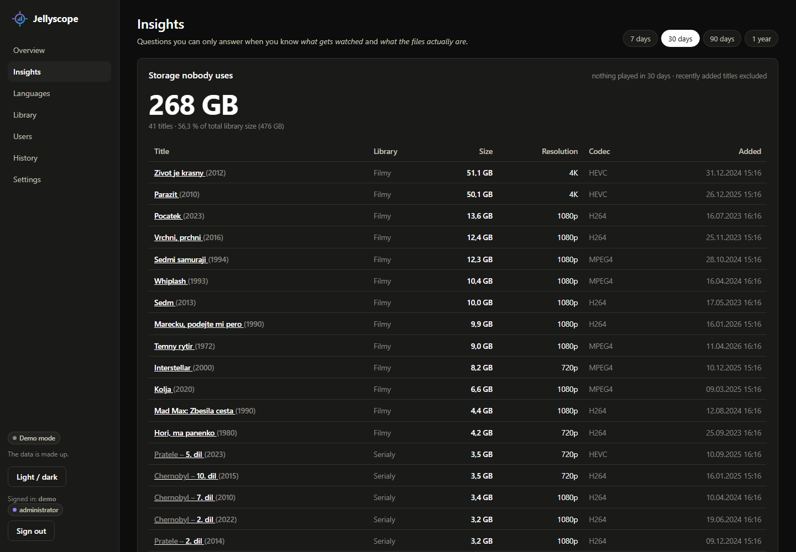
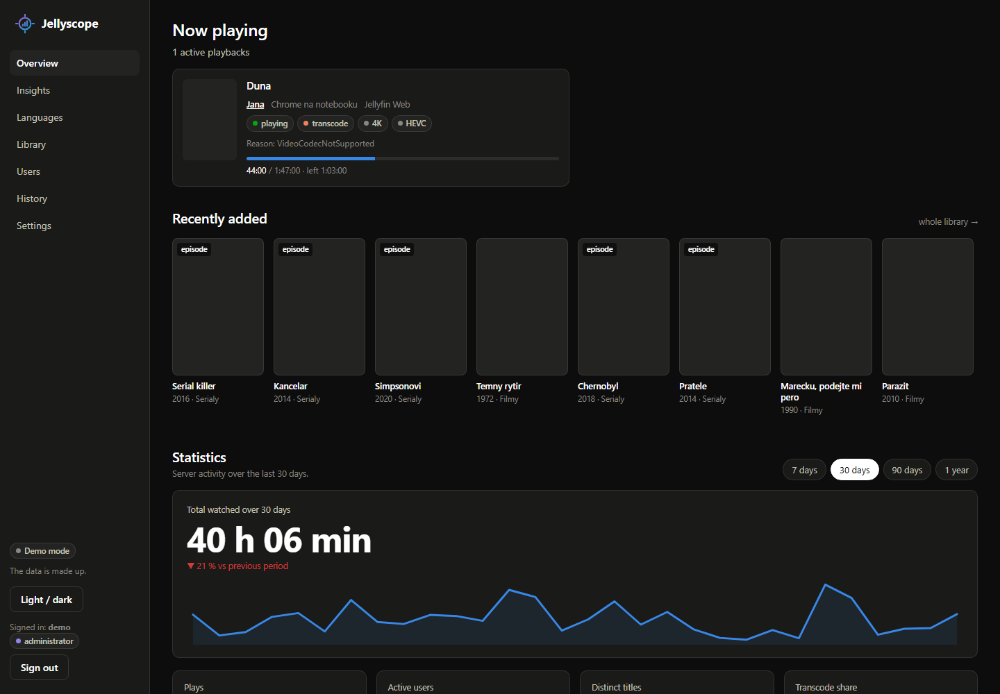
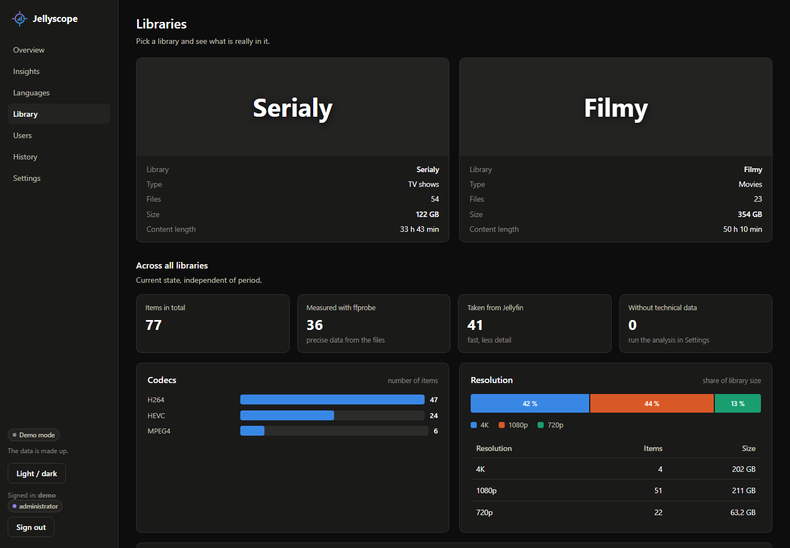
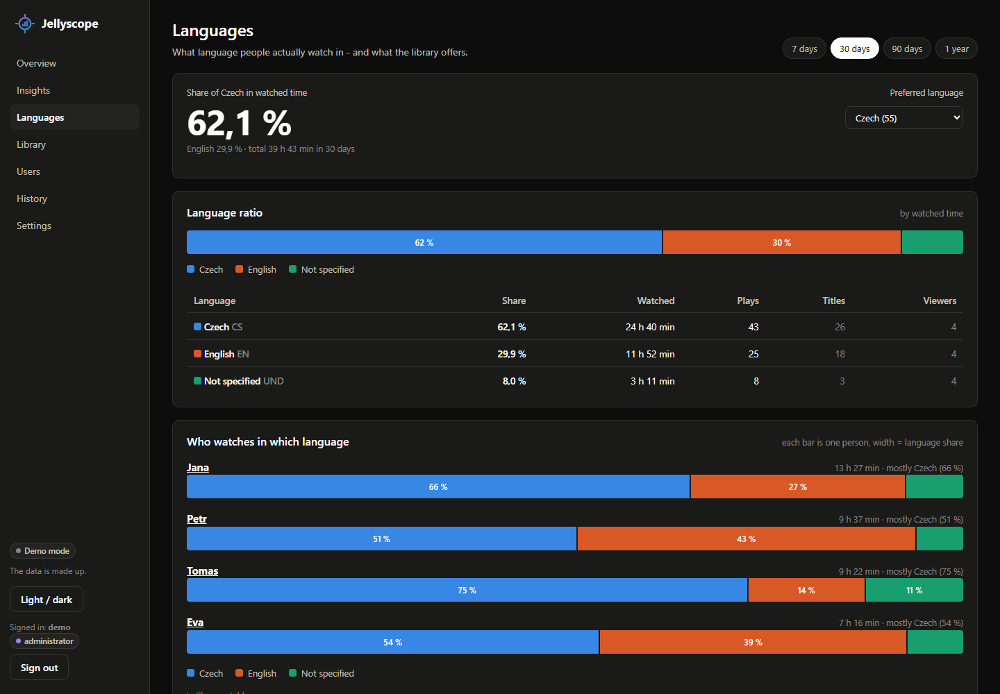

# Jellyscope

[](https://github.com/SpeeDFireCZE/jellyscope/actions/workflows/tests.yml)
[](LICENSE)
[](https://www.python.org/downloads/)

Jellyfin statistics that **connect what people watch with the technical
state of the library**.

Inspired by two existing projects:

- **[Jellystat](https://github.com/CyferShepard/Jellystat)** — knows *what is
  being watched*
- **[MediaLyze](https://github.com/frederikemmer/MediaLyze)** — knows *what
  those files are*

Jellyscope is not a copy of either. It is an independent implementation of
both ideas in one app, because only together can they answer questions
neither can answer alone:

> "How many terabytes are taken up by content nobody has watched in a year?"
> "Which file makes the server transcode most often?"
> "What do I watch the most — and do I even have it in decent quality?"
> "Which 60 GB 4K film did I watch once and never again?"

---

## What it looks like

**Insights** — the page the whole project exists for. Behaviour meets
technique: how much space is taken by things nobody watches, which files
make the server transcode, what you have in 4K and never finished.



**Overview** — what is playing right now, what was added, and the numbers
for the chosen period.



| Library | Languages |
|---|---|
|  |  |
| Codecs, resolutions and sizes of what you really have. | What language people watch in — and what the library offers. |

<sub>Screenshots are from the demo mode, so the data is made up and the
posters are empty — a real installation loads them from Jellyfin.</sub>

---

## What it does

| Page | Contents |
|---|---|
| **Overview** | Live playbacks, watched time, most active users and titles, transcode share, a "when do people watch" heatmap |
| **Insights** | Dead storage, most transcoded files, upgrade candidates, oversized files, possible duplicates |
| **Languages** | Language split in percent, who watches dubbed and who in the original, subtitles, titles with no Czech track |
| **Library** | Tiles for each Jellyfin library → detail with Overview / Media / Activity tabs → file detail |
| **Users** | Watch time per user, devices, individual detail |
| **History** | Every recorded playback, with language and links to the user and the title |
| **Settings** | Data source, scheduled tasks, backups, history import, accounts, blocked logins, log |

### Library and file detail

`/library` shows **a tile per Jellyfin library** with a poster, size and
title count. Opening one gives three tabs:

- **Overview** — codecs, resolutions, languages in this library
- **Media** — a poster grid with file size, sorting and search
- **Activity** — what was watched from this library, by whom and when

A tile opens the **file detail**: container, path, size, video track,
**every audio track with language and channel count**, **every subtitle**
(including *forced* / *external file* flags), the playback history of that
title, and for episodes a list of the other episodes.

There is a **Reload metadata** button on each title. It asks Jellyfin about
that one title — handy after you fix wrong metadata on the Jellyfin side
and do not want to wait for the nightly sync.

Images are downloaded from Jellyfin **through Jellyscope** and cached on
disk, so the Jellyfin address and API key never reach the browser.

### Two sources of technical data — you pick in Settings

The choice only affects **file details** (codec, resolution, bitrate, size):

- **Jellyfin API only** — we take what Jellyfin reports. Works immediately,
  needs nothing extra.
- **ffprobe + Jellyfin** — files are read directly from disk. More accurate,
  but needs ffmpeg installed and access to the files.

**Playback statistics always come from Jellyfin** — ffprobe can read a file,
not tell who watched what. The list of titles, users and libraries comes
from Jellyfin either way.

### Languages

Which language people actually pick, per user and per title — including
"they had a choice and picked Czech anyway" versus "there was nothing else".
Titles whose audio track has no language code at all get their own page, so
you can fix the files rather than guess.

### Scheduled tasks and backups

**Settings → Scheduled tasks** has three tasks:

| Task | When | What it does |
|---|---|---|
| Library sync | daily at a set time | Downloads users, libraries and titles. With ffprobe selected, an analysis of files without technical data follows. |
| Recently added titles | every N minutes | Only fetches what is not in the library yet. Barely touches Jellyfin, so it can run often. |
| Database backup | daily at a set time | Saves a copy into the chosen folder and deletes surplus older ones. |

The two nightly tasks are scheduled by **time of day**, not by interval:
an interval counts from the last run, so every manual run would push the
schedule and a 3:30 AM task would drift into the afternoon. A missed run
(the machine was off) is caught up after start; a manual run never changes
the schedule.

Backups can be downloaded, deleted and restored from the same page.
Restoring saves the current state first, so a misclick costs nothing.
SQLite backups use the built-in snapshot function rather than a file copy —
a copy taken mid-write can be corrupt.

### History import

Jellyscope only records playbacks while it runs. If you already have history
elsewhere, it can be taken over in **Settings → History import**:

- **Playback Reporting** — a Jellyfin plugin. Data is read straight through
  Jellyfin, no file upload needed (a file upload is there for when the
  plugin's API misbehaves).
- **Jellystat** — export a JSON backup and upload it.

Imports are **idempotent**: run one ten times and nothing is duplicated.

Imported data carries no audio language or transcode reason — neither tool
stores them. Some Playback Reporting versions do record the language, and
those rows are counted.

Imported history often refers to titles by name only ("Episode 7"), which
matches nothing in particular. Two tools help:

- **Clean up history** merges duplicates, repairs episode links and aligns
  names with the library.
- **Look the orphans up in Jellyfin** asks Jellyfin about the identifiers in
  the imported history — they are genuine, so Jellyfin can name the series
  and episode number the record is missing.

What is still left over is listed on **What could not be placed**, grouped
by reason, and can be assigned to a library title by hand.

### Accounts and signing in

The whole app is behind a login. On first open it asks you to create an
administrator account; further accounts are added in **Settings → Jellyscope accounts**.

Two roles:

- **administrator** — changes settings, runs tasks, manages accounts
- **viewer** — sees statistics only (right for most of a household)

Passwords are stored as a hash (PBKDF2-SHA256, 600 000 iterations, salted),
never in readable form.

---

## Try it without Jellyfin

No server, no API key, nothing to configure — the demo fills the database
with made-up data so you can click through the whole app first:

```bash
python3 -m venv .venv
.venv/bin/python -m pip install -r requirements.txt
.venv/bin/python demo.py
```

Open <http://127.0.0.1:8097> and sign in as `demo` / `demodemo`. It writes
into `data/demo.db`, so your real database (if you already have one) stays
untouched.

---

## Installation

On a Linux server one command does it:

```bash
git clone <your-repo-url> jellyscope
cd jellyscope
bash deploy/install.sh
```

The script installs what is missing, creates the virtual environment,
writes `.env` with a generated key and prints how to hand the app over to
systemd or supervisord. The whole procedure — reverse proxy, HTTPS,
PostgreSQL, backups — is in **[DEPLOY.md](DEPLOY.md)**.

By hand, without the script (Python 3.10 or newer):

```bash
python3 -m venv .venv
.venv/bin/python -m pip install -r requirements.txt
cp .env.example .env
.venv/bin/python run.py
```

Open **<http://127.0.0.1:8097>**. The app asks you to **create an
administrator account**, then go to **Settings → Jellyfin connection**, fill in the
address and an API key (Dashboard → Advanced → API Keys), test the
connection and run **Synchronise library**.

There is a **Restart** button at the top right of Settings, useful for
changes that are only read at startup.

### Configuration

`.env` holds only what the app needs *before* it can open the database:

| Key | Meaning |
|---|---|
| `SECRET_KEY` | Signs login cookies. Leave it empty and the app generates one into `data/secret_key`. |
| `HOST`, `PORT` | Where to listen. Default `127.0.0.1:8097`. |
| `DATABASE_PATH` | SQLite file. Default `data/jellyscope.db`. |
| `SECURE_COOKIES` | Turn on behind an HTTPS proxy. |
| `FORWARDED_ALLOW_IPS` | The proxy's address, so the app sees real client addresses. |

Everything else — the Jellyfin connection, data source, tasks, language —
is configured **in the app** and stored in the database.

`data/secret_key` belongs in your backups. Without it everyone has to sign
in again after a restore.

### Database: SQLite or PostgreSQL

**Settings → Database.** The default is **SQLite** — the whole database is
one file, nothing to install, and plenty for a household.

**PostgreSQL** makes sense when you already run one. It needs the `psycopg`
driver:

```bash
.venv/bin/python -m pip install "psycopg[binary,pool]"
```

Switching: fill in the connection → **Test connection** → **Transfer data**
(copies everything from the old database) → **Save and use after restart**
→ **Restart Jellyscope**.

Two safeguards: the settings are **not saved** until the connection works
(you cannot lock yourself out), and the transfer empties the target first,
so running it twice does not duplicate anything.

The database settings are the one thing that does not live in the database —
they are in `data/database.json`. They cannot be anywhere else; they are
what tells us how to connect.

### Interface language

**Settings → Interface language** switches between Czech and English, for the whole
app. The application log has its own language setting — a log is often read
by somebody else, and English messages are easier to search for.

A missing translation falls back to Czech, so you never get a blank spot.

### ffmpeg (optional)

Only needed for reading files locally. **`deploy/install.sh` installs it
for you** — this is for the case where you skipped it with `SKIP_FFMPEG=1`
or installed by hand.

1. `sudo apt install ffmpeg`
2. In **Settings → Technical data source** switch the source to **ffprobe +
   Jellyfin** and fill in the path to `ffprobe` if it is not on `PATH`
3. In **Settings → File analysis** press **Analyse missing**

---

## Important: history starts today

Jellyfin **does not keep** playback history. It can only tell you what is
playing right now. Jellyscope therefore asks every few seconds and builds
the history itself.

That means **there is no past data**. The Insights page becomes useful after
a few weeks of running. The technical analysis of the library, on the other
hand, works immediately.

If you have history in Playback Reporting or Jellystat, import it — see
[History import](#history-import).

---

## Managing accounts from the command line

Useful mainly when you cannot get into the app:

```bash
.venv/bin/python manage.py ucty            # list accounts
.venv/bin/python manage.py pridat jana     # add an account
.venv/bin/python manage.py pridat petr --spravce
.venv/bin/python manage.py heslo petr      # change a password
.venv/bin/python manage.py smazat jana
```

A forgotten password cannot be read back from the hash — that is the point.
Set a new one with `manage.py heslo <name>`.

---

## Security

By default the app listens on `127.0.0.1` only — reachable from that machine
alone. That is deliberate.

To open it up to your network:

1. Give everyone else **viewer** accounts, not administrator ones
2. Set `HOST=0.0.0.0`
3. Put a reverse proxy with HTTPS in front of it, and set `SECURE_COOKIES=1`
   and `FORWARDED_ALLOW_IPS`

What the app does on its own:

- everything is behind a login; without an account you get nowhere
- passwords are stored as PBKDF2-SHA256 hashes (600 000 iterations, salted)
- a failed login does not reveal whether the name or the password was wrong
- signing in discards the old session (session fixation)
- repeated failed logins block that address, each block longer than the last
  (1, 2, 5, 15 minutes, then permanent); administrators can lift a block in
  **Settings → Blocked addresses**
- when `SECRET_KEY` is not set, a random one is generated and stored —
  never a fixed value from the source code
- permissions are enforced on the server, not by hiding buttons
- the Jellyfin API key never leaves the server, and item ids from the URL
  are validated before they are used in a request to Jellyfin
- no third-party JavaScript, no CDN; the page never calls out to the internet
- every SQL query uses parameters, never string concatenation
- `ffprobe` runs without a shell, so a filename cannot become a command
- files are only ever read; the app deletes and overwrites nothing
- the login cookie is signed and `SameSite=lax`; responses carry
  `X-Content-Type-Options`, `X-Frame-Options` and `Referrer-Policy`

---

## Project structure

```
jellyscope/
├── run.py                  launcher
├── demo.py                 demo mode with made-up data
├── manage.py               account management from the command line
├── requirements.txt        dependencies
├── .env                    your secrets (not in git)
├── deploy/                 installer, service configs, proxy examples
├── tests/                  the test suite (needs no Jellyfin)
├── data/                   database, logs, image cache (not in git)
└── jellyscope/
    ├── config.py           reads .env, generates the signing key
    ├── db.py               connection, migrations, settings cache
    ├── dialect.py          translates SQLite SQL to PostgreSQL
    ├── dbmigrate.py        copies data between the two databases
    ├── schema.sql          the shape of the database
    ├── accounts.py         accounts, passwords, login blocks
    ├── jellyfin.py         talking to Jellyfin
    ├── probe.py            ffprobe
    ├── languages.py        unifying language codes
    ├── collector.py        background playback collection
    ├── scanner.py          library sync + file analysis
    ├── tasks.py            scheduler and backups
    ├── importers.py        history import and its repairs
    ├── stats.py            statistical SQL queries
    ├── insights.py         behaviour meets technique ← the core idea
    ├── langstats.py        language statistics
    ├── charts.py           hand-drawn SVG charts
    ├── formatting.py       numbers for humans
    ├── i18n.py             translations, including log messages
    ├── applog.py           log file and its viewer
    ├── web.py              routes
    ├── demodata.py         generator of made-up data for the demo
    ├── templates/          HTML templates
    └── static/style.css    styling
```

**The comments in the source are in Czech.** The interface and the
documentation are bilingual, the comments are not: they are long and
explanatory — written to say *why* a thing is done that way, usually
naming the bug that would happen otherwise — and translating them would
cost more than it would add. Pull requests with English comments are
welcome all the same; see [CONTRIBUTING.md](CONTRIBUTING.md).

---

## Common problems

| Problem | Fix |
|---|---|
| `ModuleNotFoundError` after a restart | The service runs the system Python. Use the full path to `.venv/bin/python`. |
| Nothing answers on `:8097` | `HOST=127.0.0.1` and you are connecting from another machine. |
| Collector reports 401 | Wrong API key. Create a new one in Jellyfin. |
| Collector reports a connection error | Wrong Jellyfin address, or Jellyfin is not running. |
| Analysis fails on every file | Jellyscope cannot see the paths Jellyfin reports → set up Path mapping. |
| Insights page is empty | Not enough history yet. Let it run for a few days. |
| Charts and library are both empty | The library sync has not run yet. |
| Everyone was signed out | The signing key changed — see `SECRET_KEY` in [Configuration](#configuration). |

---

## Tests

Plain scripts, no pytest. Each one sets up its own temporary database, so
they need no Jellyfin, no network and no ffmpeg:

```bash
for t in tests/test_*.py; do .venv/bin/python "$t" || break; done
```

The same loop runs in GitHub Actions on Python 3.10 and 3.13 for every push
and pull request.

---

## Contributing

Bug reports and pull requests are welcome — please open an issue first for
anything bigger than a bug fix. How to run the app, how to write a test that
can actually fail, and what falls outside the scope of the project:
**[CONTRIBUTING.md](CONTRIBUTING.md)**.

Found a security hole? Do not open an issue — see
**[SECURITY.md](SECURITY.md)**.

---

## Licence

[MIT](LICENSE). The code is written independently; nothing was taken from
Jellystat or MediaLyze — only the idea of what is worth measuring.
